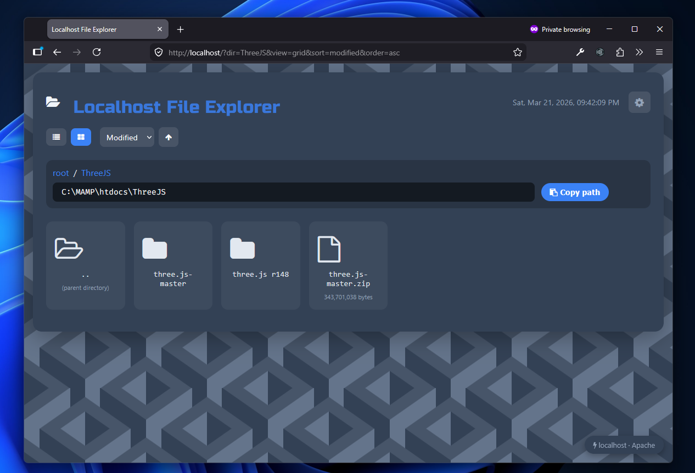

# Localhost File Explorer

A clean, modern PHP-based file browser for navigating your local MAMP/WAMP web server directories. Perfect for developers who want a visual way to browse and access their localhost projects.




## Features

- 📁 **Directory Navigation** - Browse through your localhost directories with an intuitive interface
- 🔗 **Breadcrumb Navigation** - Easily track and navigate your current path
- 📋 **Copy Path** - One-click copy of the full filesystem path to clipboard
- 🔍 **Smart Folder Detection** - Automatically detects folders with index files (index.php, index.html, index.htm)
- ⏰ **Live Date/Time Display** - Real-time clock in the header
- 📂 **Sorted Listings** - Folders displayed first, then files, both alphabetically sorted
- 🎨 **Modern Dark UI** - Clean, responsive design with Font Awesome icons

## How It Works

### Folder Behavior
- **Folders with an index file**: Clicking the folder name opens the project directly. A search icon (🔍) allows you to browse the directory contents instead.
- **Folders without an index file**: Clicking navigates into the directory using the file explorer.

### File Behavior
- Files open directly in a new browser tab when clicked.
- File sizes are displayed in bytes.

## Installation

1. Place the `index.php` file in your MAMP/WAMP `htdocs` directory (or any subdirectory you want to browse)
2. Ensure you have a `style.css` file at the root of your web server (`/style.css`) or modify the stylesheet link
3. Access via your browser: `http://localhost/path/to/explorer/`

## Requirements

- PHP 5.6 or higher
- Web server (MAMP, WAMP, XAMPP, or similar)
- Modern web browser with JavaScript enabled

## Security

- **Path Sanitization**: The explorer prevents directory traversal attacks by validating that all accessed paths remain within the base directory
- **Access Control**: Attempting to access paths outside the root directory will result in an "Access denied" message

## Customization

### Styling
The explorer uses:
- External stylesheet at `/style.css` for base styles
- Inline CSS for component-specific styling
- CSS custom property `--accent` for the accent color
- Font Awesome 4.7.0 for icons

### Adding Index File Types
To recognize additional index files, modify the `$indexFiles` array:

```php
$indexFiles = ['index.php', 'index.html', 'index.htm', 'default.aspx'];
```

## License

This project is open source and available for personal and commercial use.

## Contributing

Feel free to fork, modify, and submit pull requests to improve this file explorer!
