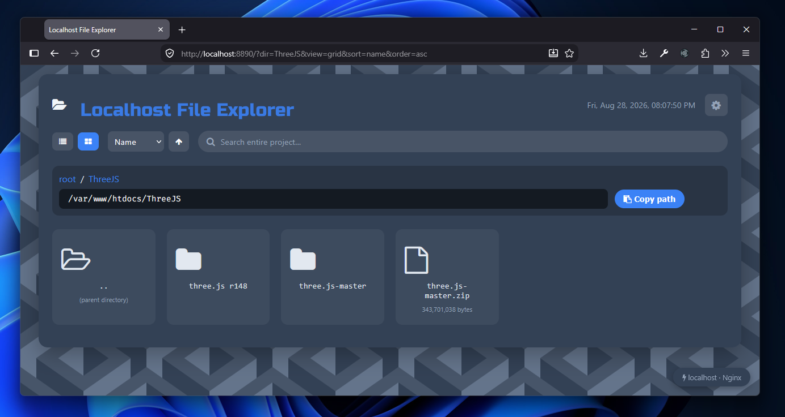

# Localhost File Explorer

A clean, modern PHP-based file browser for navigating your local web server directories. Perfect for developers who want a visual way to browse and access their localhost projects.




## Quick Start

1. Copy the `index.php` file into any directory on your web server
2. Open it in your browser: `http://localhost/path/to/explorer/`
3. That's it - no configuration needed

Works with MAMP, WAMP, XAMPP, Laragon, USBWebserver, standalone Apache/Nginx/IIS, or PHP's built-in server (`php -S localhost:8000`). Requires PHP 5.6+.

## Features

- 📁 **Directory Navigation** - browse your localhost folders with an intuitive interface
- 🔎 **Project Search** - jump straight to a project by name, no matter how deep it's nested. Search from the toolbar box, or set it up as a browser address-bar search engine and jump to a project by typing a keyword + your term, without opening this page first
- 🔍 **Smart Folder Detection** - folders with an index file open directly when clicked
- 📂 **Sorting & Dual Views** - sort by name, size, or modified date; toggle list or grid view
- 🔗 **Breadcrumbs & Copy Path** - track your current location and copy its full filesystem path
- 🎨 **Themes & Appearance** - dark/light mode, hue rotation, font size, and background patterns, all persisted across sessions
- 🔧 **Server Auto-Detection** - shows which web server (Apache, Nginx, IIS, etc.) is serving the page
- ⏰ **Live Clock** and 🚀 **Single-File Deployment** - everything lives in one `index.php` file

## Basic Usage

- **Browse**: click a folder name to open it directly (if it has an index file) or step into it; use the breadcrumbs or `..` to go back
- **Search**: type into the toolbar search box to find a project folder anywhere in the tree by name - or set it up as a browser search engine to jump to a project straight from the address bar (see [Search](#search) in Documentation)
- **Switch view**: the list/grid buttons in the toolbar
- **Sort**: the dropdown and order-toggle button in the toolbar
- **Customize appearance**: the ⚙️ gear icon opens theme, color, font, and background pattern settings

For exactly how folder detection, search matching, and settings work - see [Documentation](#documentation) below.

---

## Documentation

In-depth reference: how folder/search detection actually works, troubleshooting, security notes, and how to customize the code.

### How It Works

#### Folder Behavior
- **Folders with an index file**: Clicking the folder name opens the project directly. A search icon (🔍) allows you to browse the directory contents instead.
- **Folders without an index file**: Clicking navigates into the directory using the file explorer.

> This "has an index file" check (`hasIndex()`, using the `$indexFiles` list) is separate from - and narrower than - the Project/Notebook detection Search uses (`classifyFolder()`, below). A folder can be labeled **Project** in search results without having a direct-open link here, e.g. one that only has a `README` or `package.json`.

#### File Behavior
- Files open directly in a new browser tab when clicked.
- File sizes are displayed in bytes.

#### View Modes
- **List View**: Traditional detailed view with file metadata
- **Grid View**: Icon-based view perfect for visual browsing

#### Sorting Options
- **Name**: Alphabetical sorting (A-Z or Z-A)
- **Size**: Sort by file size (smallest to largest or vice versa)
- **Modified**: Sort by last modification date (oldest to newest or newest to oldest)

### Search

- Type a term into the search box in the toolbar (or open `?q=term` directly) to find a folder by name anywhere in the project tree - i.e. "jump to a project," however deep it's nested.
- Matching is a case-insensitive substring match against folder names. It doesn't match individual files.
- **Search recurses, but prunes at every project boundary.** Each folder is classified as it's encountered (see below); the moment a folder itself qualifies as a project or notebook, its contents are never scanned - only plain organizational folders get recursed into further. Since a project's internals (`node_modules`, vendor libraries, build output, deep source trees) are usually the vast majority of a real tree's files, this keeps search fast without needing to cap it at one directory level.
- Every matching folder is returned, **except** version-control/dependency folders (`.git`, `.svn`, `.hg`, `.idea`, `.vscode`, `node_modules`, `vendor`) and Windows system folders (`System Volume Information`, `$RECYCLE.BIN`), which never count as a match even if their name fits and are never recursed into. Symlinks/junctions are skipped too.
- Matching folders are labeled based on their own immediate contents, judged by what's inside them:
  - Contains `notebook.nbk` → labeled **Notebook** (shown with a book icon)
  - Contains any of the following → labeled **Project**:
    - Web: any `.php`, `.html`, or `.htm` file, `index.js`, or any TypeScript file (`.ts`/`.tsx`)
    - General: a `README`, a `LICENSE`, a `.git` folder or `.gitignore`, or a `Makefile`
    - Node.js: `package.json`, `package-lock.json`, `yarn.lock`, or `pnpm-lock.yaml`
    - PHP (Composer): `composer.json` or `composer.lock`
    - Python: `requirements.txt`, `pyproject.toml`, `Pipfile`, or `manage.py`
    - Rust: `Cargo.toml` &nbsp; • &nbsp; Go: `go.mod` &nbsp; • &nbsp; Ruby: `Gemfile`
    - Java: `pom.xml` or `build.gradle` &nbsp; • &nbsp; .NET: `.csproj`/`.sln`
    - Docker: `Dockerfile` or a `docker-compose*.yml`
  - Otherwise (a plain organizational folder, e.g. one that just contains other folders) → shown with no label, but still included in results
- As a defensive backstop against pathological trees (e.g. thousands of nested plain folders with no project markers anywhere), the scan stops after ~50,000 folders visited or 20 seconds - tune `$maxNodes`/`$maxSeconds` in `searchProjects()` if you ever need different limits. In practice, pruning keeps real-world trees well under this.
- Click "Clear search" (or remove `q` from the URL) to return to normal folder browsing.

**Tip - search straight from your browser's address bar:** because search works off a plain `?q=` URL, you can add it as a custom search engine in your browser and jump to a project without opening this page first:
1. In your browser's search engine settings (e.g. Chrome/Edge: `chrome://settings/searchEngines`, under "Site Search"), add a new entry
2. Set its URL to `http://localhost:8890/?q=%s` (swap in whatever host/port this is actually running on) - `%s` is where your browser substitutes the search term
3. Give it a keyword (e.g. `project`), then in the address bar type that keyword, <kbd>Tab</kbd>, your search term, and Enter

This requires the PHP server this app is running on to actually be running - if it's not, the request will fail to connect rather than search anything.

### Toolbar

The toolbar at the top of the explorer provides quick access to view and sort controls:

- **View Toggle**: List View (📋) shows files in a detailed list with metadata; Grid View (🗂️) shows them as large icons in a grid layout
- **Sort Controls**: a dropdown to pick the sort criteria (Name, Size, Modified) and a button to toggle ascending (↑) / descending (↓)

Your preferences are automatically saved using localStorage and persist across browser sessions.

### Settings Modal

Click the gear icon (⚙️) in the top-right corner to open the settings modal:

- **Theme Mode**: Dark Mode (default, dark backgrounds/light text) or Light Mode (white backgrounds/dark text)
- **Hue Rotation**: adjusts the overall color hue of the interface (0°-360°) while maintaining readability
- **Font Size**: controls the base font size (12px-24px) across file names, breadcrumbs, and metadata in both view modes
- **Background Patterns**: 5 geometric patterns with 3D effects - Overlapping Cubes, Triangles, Squares, Cube Columns, Rectangles - each with a subtle gradient overlay for readability and smooth transitions between them. "None" shows a clean gradient background instead.
- **Reset to Defaults**: restores all settings and clears their localStorage entries

All settings are automatically saved to localStorage and persist across browser sessions.

### Requirements

- PHP 5.6 or higher
- Web server with PHP support
- Modern web browser with JavaScript enabled
- Internet access, for the browser to load two CDN-hosted stylesheets: [Font Awesome 4.7.0](https://cdnjs.cloudflare.com/) (all icons) and [Google Fonts](https://fonts.googleapis.com/) (Russo One, Inter, Roboto, Fira Code, Open Sans). Without it, the page still loads and works - icons just won't render, and text falls back to your OS's default fonts

### Troubleshooting

#### "Failed opening required..." Error

If you see an error like:
```
Failed opening required 'C:/path/to/root/index.php' (include_path='.;C:\php\pear') in Unknown on line 0
```

This is **NOT** caused by this file explorer. This error indicates your PHP configuration has an `auto_prepend_file` directive that's trying to include a file that doesn't exist.

**Solution:**
1. Check your `php.ini` file for `auto_prepend_file` directive
2. Look in your server's configuration (httpd.conf, .htaccess, etc.)
3. For USBWebserver, check the `settings` folder for PHP configuration
4. Either remove the directive or ensure the referenced file exists

#### "Access denied" Message

This appears when attempting to navigate outside the explorer's root directory. This is a security feature.

#### Blank Page / No Output

1. Check PHP error logs
2. Ensure PHP is properly configured
3. Verify file permissions (readable by web server)

#### Styles Not Loading

Most of the explorer's CSS is inline in the page, but icons and custom fonts are loaded from Font Awesome and Google Fonts CDNs (see [Requirements](#requirements)) - if those specifically look broken (missing icons, fallback fonts), it's usually a connectivity issue reaching those CDNs, not the app itself. If the whole layout looks broken:
1. Ensure JavaScript is enabled (for some dynamic features)
2. Check browser console for errors
3. Try a hard refresh (Ctrl+Shift+R)

#### View/Sort Settings Not Persisting

1. Ensure cookies/localStorage are enabled in your browser
2. Try clearing browser cache and reloading
3. Check browser console for JavaScript errors

### Security

- **Path Sanitization**: The explorer prevents directory traversal attacks by validating that all accessed paths remain within the base directory
- **Access Control**: Attempting to access paths outside the root directory will result in an "Access denied" message
- **No Write Access**: This tool only reads and displays files - it cannot modify, delete, or create files
- **Client-Side Storage**: Preferences are stored locally in your browser using localStorage (no server-side storage)

### Customization

#### Adding Index File Types
To recognize additional index files, modify the `$indexFiles` array at the top of the file:

```php
$indexFiles = ['index.php', 'index.html', 'index.htm', 'default.aspx', 'index.jsx'];
```

#### Changing What Counts as a Project in Search
Search's project/notebook detection lives in the `classifyFolder()` function, which already recognizes common markers across several ecosystems (see [Search](#search) for the full list). To recognize another one (e.g. a `Vagrantfile` or a project-specific config file), add a check inside its loop:

```php
if ($lower === 'vagrantfile') {
    $isProject = true;
}
```

#### Changing Colors
Modify the CSS variables in the `:root` selector:

```css
:root {
    --accent: #3b82f6;    /* Link/button color */
    --bg-dark: #1e293b;   /* Background color */
    --bg-card: #334155;   /* Card background */
}
```

#### Adding New Sort Options
To add additional sorting criteria, modify the sorting function in the PHP code:

```php
case 'type':
    $result = strcasecmp(pathinfo($a['name'], PATHINFO_EXTENSION), 
                         pathinfo($b['name'], PATHINFO_EXTENSION));
    break;
```

#### Customizing Theme Colors
To modify the theme colors for dark and light modes, update the CSS variables in the JavaScript settings:

```javascript
// Dark mode colors
document.documentElement.style.setProperty('--bg-dark', '#1e293b');
document.documentElement.style.setProperty('--bg-card', '#334155');

// Light mode colors  
document.documentElement.style.setProperty('--bg-dark', '#f1f5f9');
document.documentElement.style.setProperty('--bg-card', '#ffffff');
```

#### Adding New Background Patterns
To add a new background pattern, you need to:
1. Add a new CSS class for the pattern
2. Add the pattern to the pattern select dropdown in HTML
3. Update the JavaScript to handle the new pattern

Example pattern CSS:
```css
body.pattern-your-pattern::before {
    --s: 100px;
    --c1: #334155;
    --c2: #475569;
    --c3: #64748b;
    /* Your pattern CSS here */
}
```

#### Modifying Pattern Colors
Pattern colors are controlled by CSS custom properties (--c1, --c2, --c3). To change pattern colors for different themes:

```css
/* Dark mode pattern colors */
body.pattern-overlapping-cubes::before {
    --c1: #334155;
    --c2: #475569;
    --c3: #64748b;
}

/* Light mode pattern colors */
body.light-mode.pattern-overlapping-cubes::before {
    --c1: #f2f2f2 !important;
    --c2: #cdcbcc !important;
    --c3: #b9b9b9 !important;
}
```

#### Adjusting Gradient Overlay
The gradient overlay that makes patterns less distinct can be modified:

```css
body::after {
    background: linear-gradient(135deg, rgba(30, 41, 59, 0.7) 0%, rgba(15, 23, 42, 0.7) 100%);
    /* Adjust opacity or colors as needed */
}

body.light-mode::after {
    background: linear-gradient(135deg, rgba(241, 245, 249, 0.7) 0%, rgba(226, 232, 240, 0.7) 100%);
}
```

### Technical Details

#### URL Parameters
The explorer uses URL parameters to maintain state:
- `dir`: Current directory path
- `view`: View mode (`list` or `grid`)
- `sort`: Sort criteria (`name`, `size`, `modified`)
- `order`: Sort order (`asc` or `desc`)
- `q`: Search term - when present, replaces the normal directory listing with matching project/notebook folders found anywhere in the tree (see [Search](#search))

#### Data Storage
- **Session Persistence**: Uses `localStorage` to remember user preferences
- **Automatic Redirect**: If no URL parameters are present, loads preferences from localStorage
- **Parameter Preservation**: All navigation links preserve current view/sort settings

#### Performance
- **Efficient Sorting**: Uses PHP's `usort()` with optimized comparison functions
- **Minimal Overhead**: Single file with inline CSS and JavaScript
- **Caching Friendly**: The two CDN dependencies (Font Awesome, Google Fonts - see [Requirements](#requirements)) are the only externally-loaded assets and are cached long-term by the browser after the first visit
- **Pruned Search**: Search recurses through the whole tree, but stops descending the instant a folder classifies as a project or notebook - so a project's internals never get scanned, keeping it fast regardless of tree size

## License

This project is open source and available for personal and commercial use.

## Contributing

Feel free to fork, modify, and submit pull requests to improve this file explorer!
